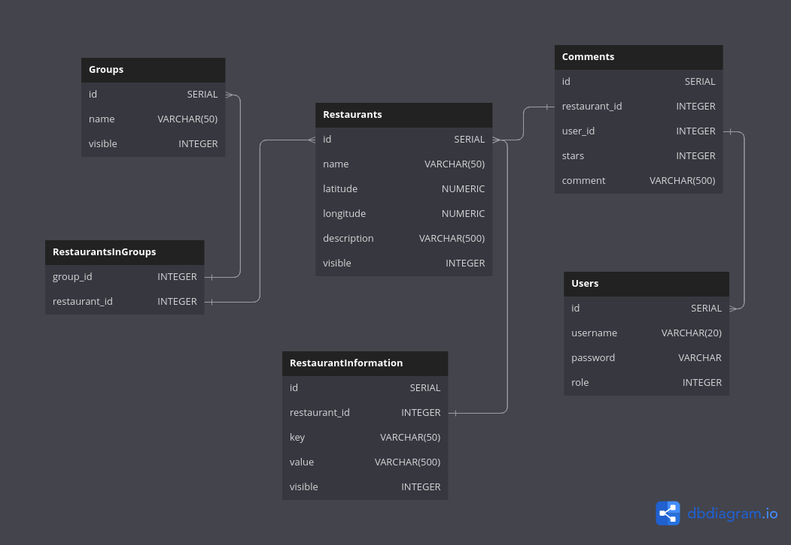

# Vaatimusmäärittely

## Sovelluksen tarkoitus

Sovelluksen avulla voi etsiä ravintoloita, antaa niille arvosteluja sekä lukea muiden antamia arvosteluja. Kirjaunut käyttäjä voi etsiä ravintoloita joko sovelluksessa näkyvästä kartasta, hakemalla hakusanalla tai valitsemalla ryhmästä. Kartalla näkyy ravintoloiden sijainti ja klikkaamalla ravintolaikonia saa kyseisen ravintolan tiedot näkyviin. Hakusana etsii löytyykö annetulla hakusanalla ravintoloita, joiden nimessä tai esittelytekstissä on hakusana. Jos yksi tai useampi ravintola löytyy, niin ne näytetään luettelona. Klikkaamalla luettelossa olevia ravintoloita saa näkyviin kyseisen ravintolan tiedot. Ryhmävalikossa on ryhmien nimiä ja valitsemalla ryhmän saa näkyviin luettelon ryhmän ravintoloista. Klikkaamalla luettelossa olevie ravintoloita saa näkyviin kyseisen ravintolan tiedot.

## Sovelluksen ominaisuudet

Sovelluksen ominaisuuksia ovat:
- Käyttäjä voi kirjautua sisään ja ulos sekä luoda uuden tunnuksen.
- Käyttäjä näkee ravintolat kartalla ja voi painaa ravintolasta, jolloin siitä näytetään lisää tietoa (kuten kuvaus ja aukioloajat).
- Käyttäjä voi antaa arvion (tähdet ja kommentti) ravintolasta ja lukea muiden antamia arvioita.
- Ylläpitäjä voi lisätä ja poistaa ravintoloita sekä määrittää ravintolasta näytettävät tiedot.
- Käyttäjä voi etsiä kaikki ravintolat, joiden kuvauksessa on annettu sana. Löydetyt ravintolat on järjestetty parhaimmasta huonoimpaan arvioiden mukaisesti.
- Käyttäjä voi hakea ravintoloita valitsemalla ryhmän. Ryhmän ravintolat on järjestetty parhaimmasta huonoimpaan arvioiden mukaisesti.
- Ylläpitäjä voi tarvittaessa poistaa käyttäjän antaman arvion.
- Ylläpitäjä voi luoda ryhmiä, joihin ravintoloita voi luokitella. Ravintola voi kuulua yhteen tai useampaan ryhmään.
- Ylläpitäjä voi muuttaa olemassaolevien käyttäjien roolin ylläpitäjäksi tai peruskäyttäjäksi
 
## Käyttäjät

Sovellukseen voi luoda oman tunnuksen, jonka jälkeen sovellusta voi käyttää ravintoloiden etsintään. Käyttäjät, joilla on pääkäyttäjä oikeudet, voivat lisätä uusia ravintoloita, luoda ryhmiä ja lisätä ravintoloita niihin sekä muokata ravintoloiden, ryhmien ja käyttäjien tietoja.

## Käyttöliittymäluonnos

Peruskäyttäjällä on neljä eri näkymää. Sisäänkirjautumissivulla käyttäjä voi kirjautua sisään sovellukseen. Luo uusi käyttäjä -sivulla uusi käyttäjä voi luoda itselleen tunnukset. Pääsivulla näkyy kartta ja muut ravintoloiden etsimismahdollisuudet. Klikkaamalla haluttua ravintolaa aukeaa ravintola-näkymä, jolla on kyseisen ravintolan tiedot. Pääkäyttäjällä on samat neljä näkymää, mutta pääsivulla on linkki ylläpitoon.

Pääkäyttäjällä on lisäksi 6 omaa näkymää. Pääkäyttäjän päänäkymässä valitaan halutaanko luoda uusi ravintola tai ryhmä vai muokata olemassa olevia tietoja. 

## Tietokantaskeema

Ohjelman tietokantaskeema on seuraava:

